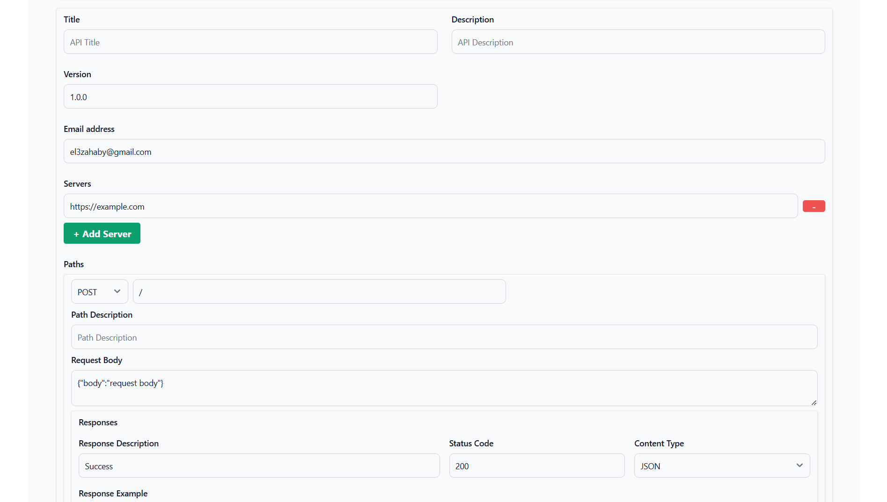

# Swagger UI Generator
[](https://www.linkedin.com/in/abdulrahman-el-zahaby/)



## Overview

egyjs Swagger Generator is a powerful, lightweight tool for generating OpenAPI (Swagger) documentation with an easy-to-use UI form. Built with **Alpine.js**, it allows developers to quickly create API specifications without the need for complex setups or coding.

## Features

- **User-Friendly Interface**: Generate Swagger documentation using an interactive UI form.
- **Dynamic Schema Generation**: Automatically generate JSON schemas from form inputs, including request bodies and response examples.
- **Multiple Content Types**: Supports JSON, XML, or both content types for API responses.
- **Live Schema Generation**: Instant live updates for Swagger JSON while editing inputs.
- **Security**: Built-in support for security schemes like Bearer Authentication.

## Getting Started

### Prerequisites

- **Node.js** (>= 12.0.0)
- **npm** or **yarn**

### Installation

Clone the repository:

```sh
$ git clone https://github.com/egyjs/swagger-generator.git
$ cd swagger-generator
```

Install dependencies:

```sh
$ npm install
```

### Running the Project

To run the Swagger Generator app locally, use:

```sh
$ npm run dev
```

Then open your browser at `http://localhost:3000` to start using the Swagger Generator UI.

## Usage

1. Fill out the form to define your API title, version, description, and URLs.
2. Add API paths and endpoints with methods such as GET, POST, PUT, DELETE.
3. Provide detailed information like request bodies and responses.
4. The generated Swagger JSON schema will automatically appear on the side panel.

## Example

Below is a sample of the generated Swagger output:

```json
{
  "openapi": "3.0.1",
  "info": {
    "title": "Example API",
    "description": "An example API for demonstration purposes",
    "version": "1.0.0"
  },
  "servers": [
    {
      "url": "https://api.example.com/v1/"
    }
  ],
  "paths": {
    "/example": {
      "get": {
        "tags": ["Example"],
        "summary": "Get example details",
        "responses": {
          "200": {
            "description": "Successful response",
            "content": {
              "application/json": {
                "schema": {
                  "type": "object",
                  "properties": {
                    "key": {
                      "type": "string",
                      "example": "value"
                    }
                  }
                }
              }
            }
          }
        }
      }
    }
  }
}
```

## Why Choose egyjs Swagger Generator?

- **Simplifies API Documentation**: No coding needed to create robust OpenAPI documentation.
- **SEO Optimized**: Optimize your project's visibility by using a structured, comprehensive approach.
- **Lightweight & Easy to Use**: Built with Alpine.js, making it incredibly fast and light for web usage.

## Support

If you have any questions or run into any issues, feel free to reach out:

- **Email**: [el3zahaby@gmail.com](mailto:el3zahaby@gmail.com)
- **LinkedIn**: [Abdulrahman El Zahaby](https://www.linkedin.com/in/abdulrahman-el-zahaby/)

## Contribution

Contributions are welcome! If you want to contribute to the development of this project, please fork the repository and submit a pull request.

## License

This project is licensed under the MIT License. See the LICENSE file for more details.

## Keywords

Swagger, OpenAPI, API Documentation, egyjs, Alpine.js, Swagger Generator, OpenAPI Generator, API, Documentation, REST API

